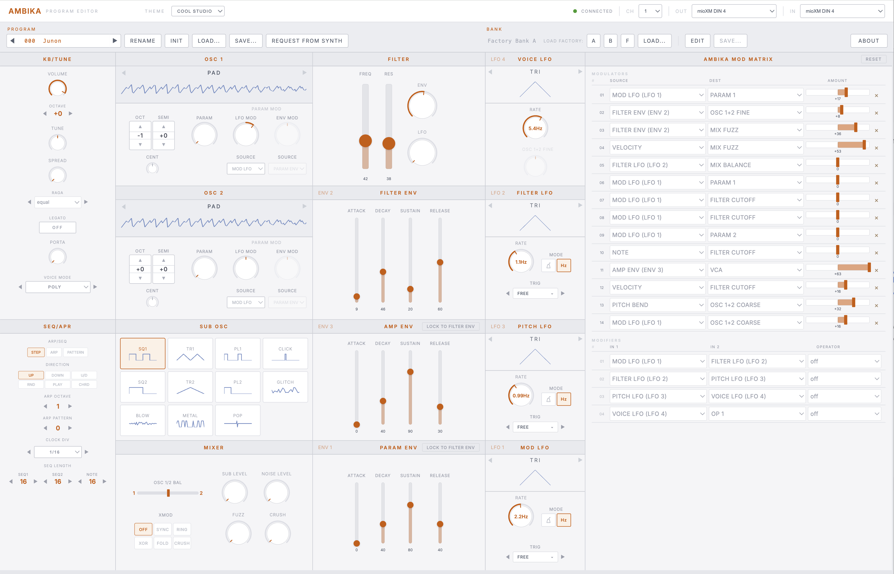
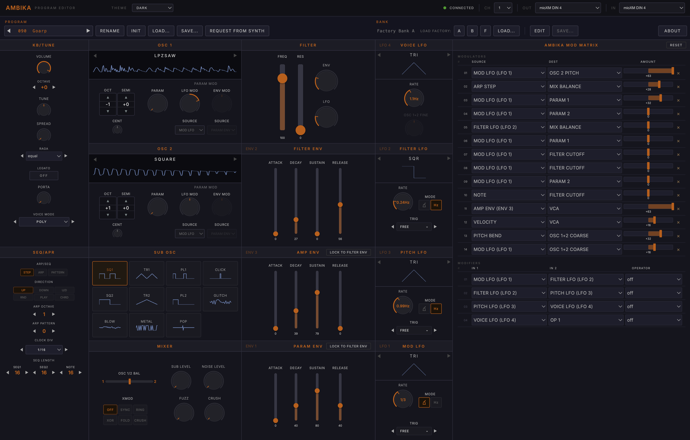
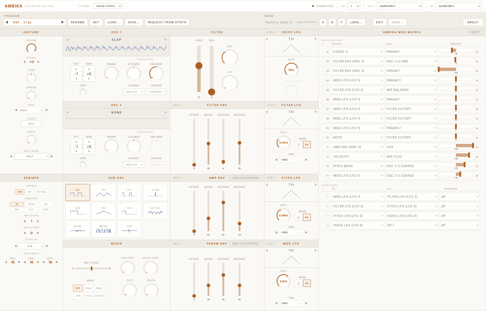
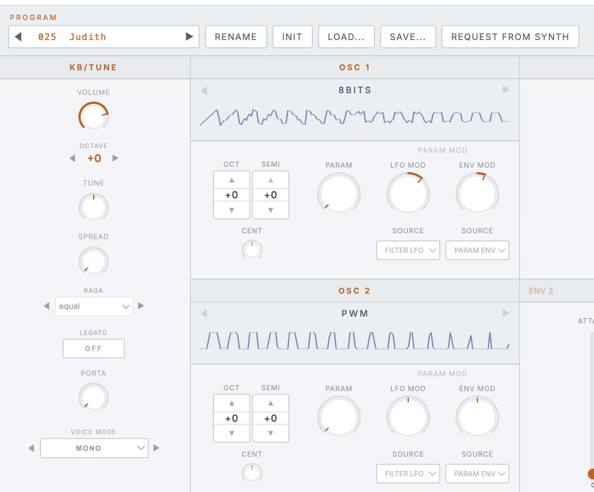
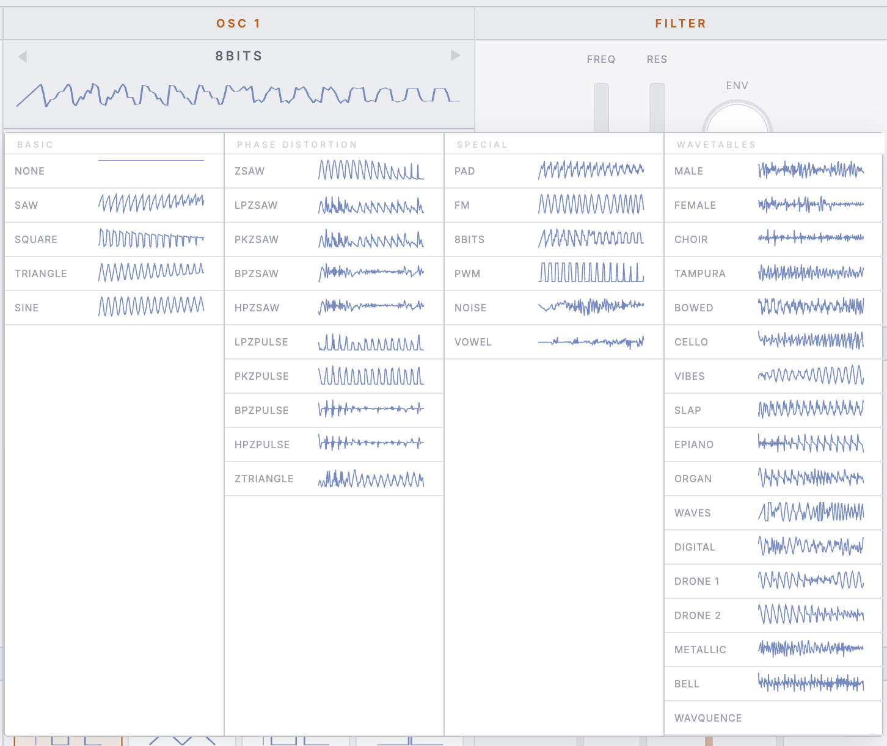
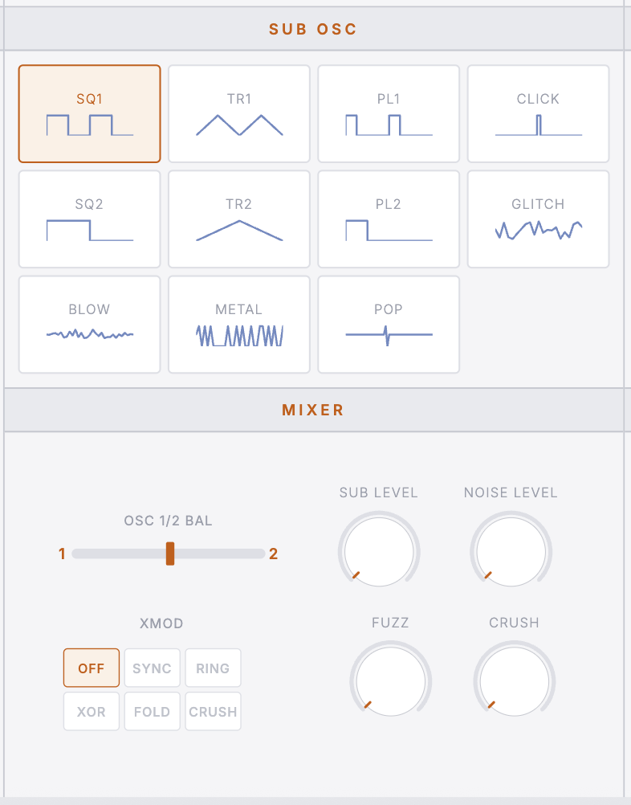
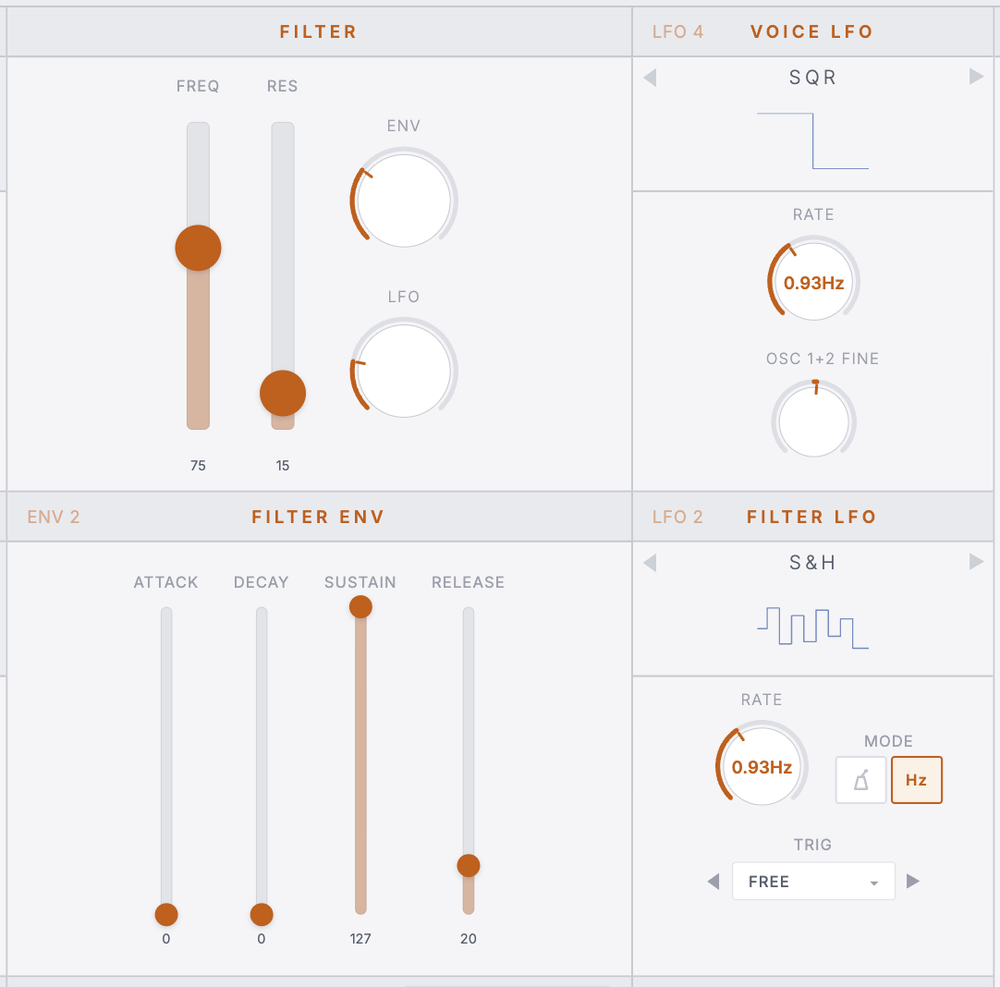
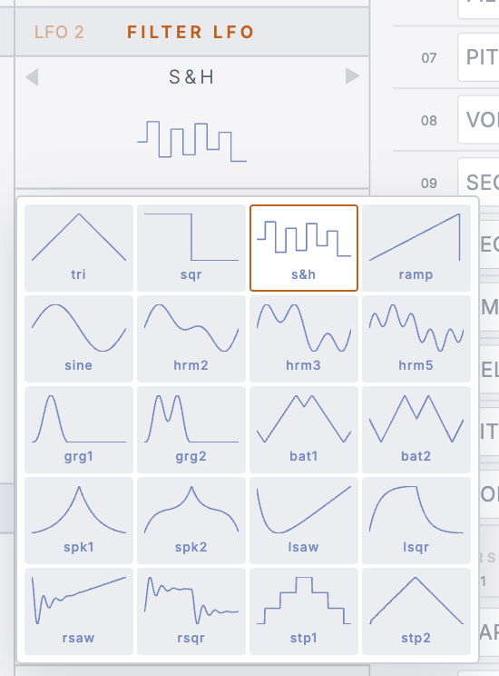
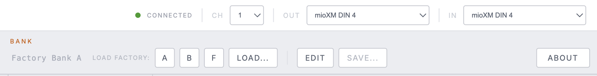
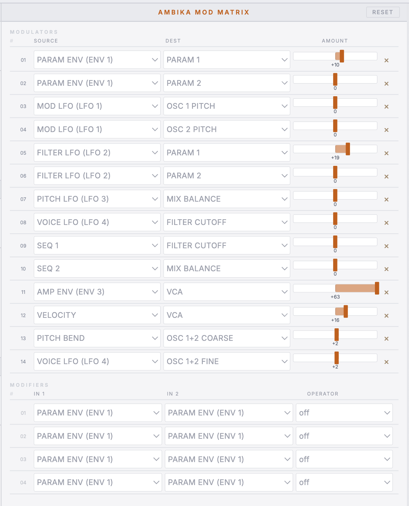

## Screenshots

### Full Editor — Cool Studio Theme

### Full Editor — Dark Theme

### Full Editor — Warm Paper Theme

### KB/Tune & Oscillator Panels

### Oscillator Waveform Picker

### Sub Oscillator & Mixer

### Filter & LFO Panels

### LFO Shape Picker

### MIDI Connection Bar

### Mod Matrix

